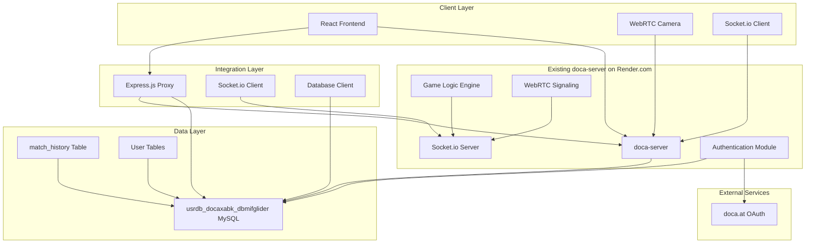
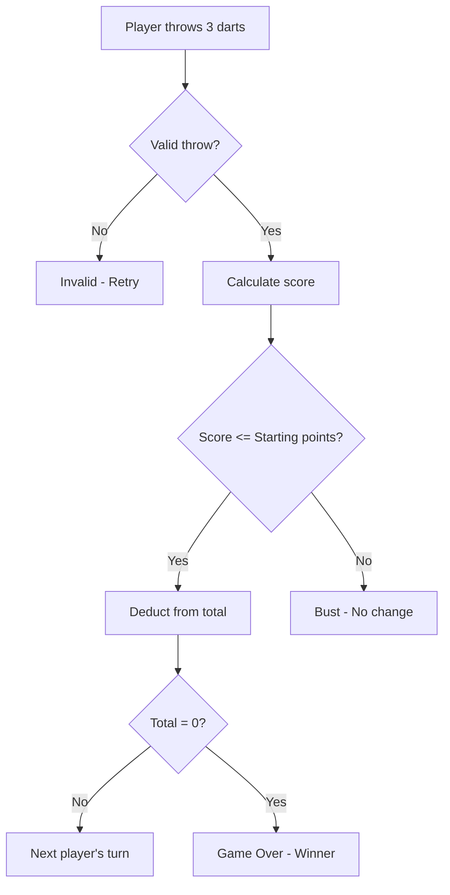
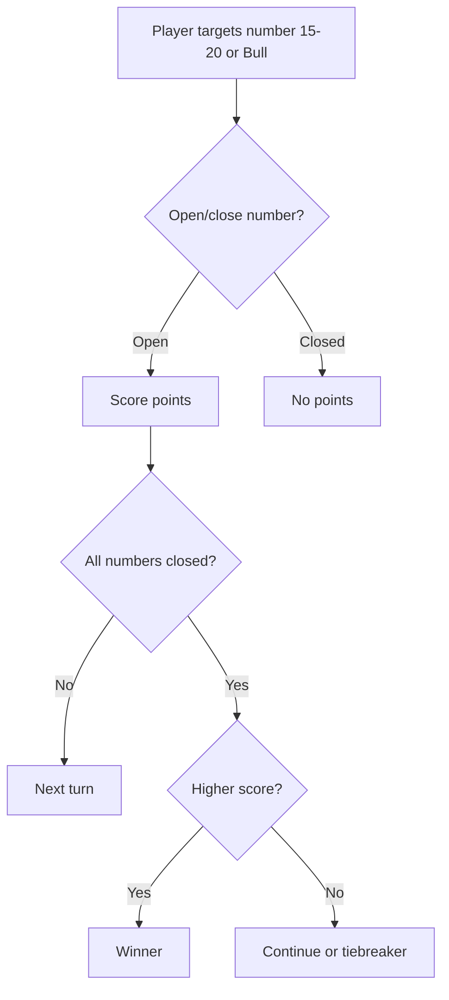
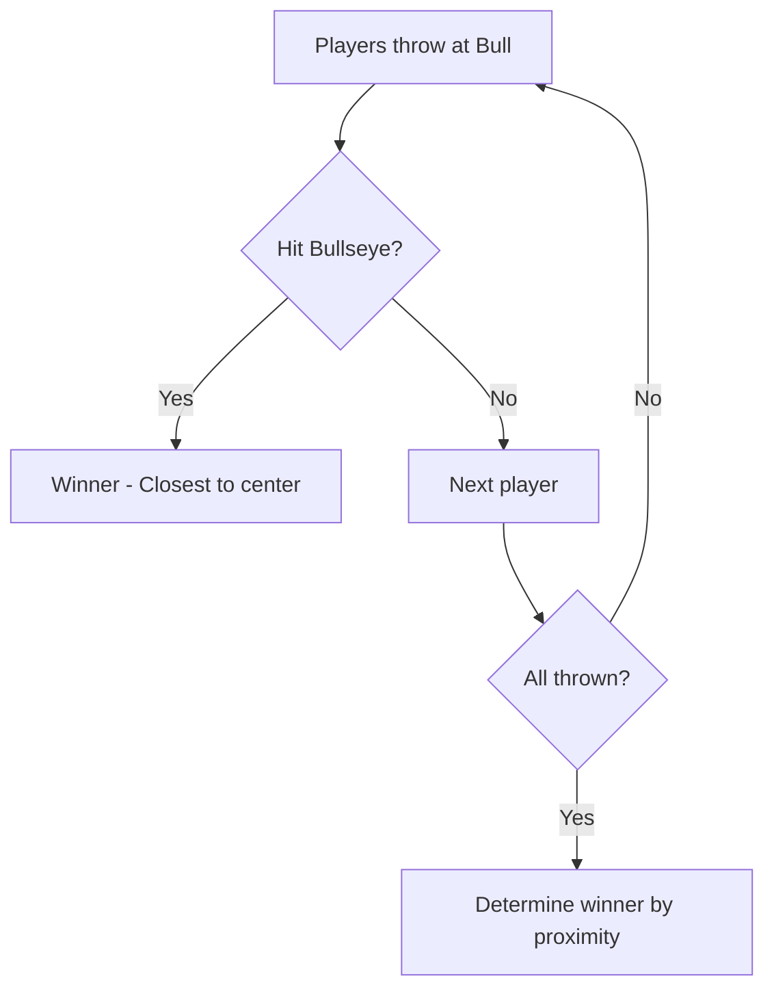

# Online Darts Web Application - Technical Specification

## 1. System Overview

The online darts web application is a real-time multiplayer platform that integrates with the existing doca-server on Render.com to provide darts gaming functionality. The application leverages the existing server's authentication system (doca.at integration), real-time capabilities, and data storage in the usrdb_docaxabk_dbmifglider database. Live game actions are processed on the doca-server, with match data stored in the match_history table for statistics calculation and UI display.

### Core Features
- **Multiplayer Game Modes**: x01 (e.g., 501, 301), Cricket, Bull-off
- **Real-time Gameplay**: Live score updates, turn management, chat via existing server
- **Video Integration**: WebRTC-based camera feed for players (requires new server endpoints)
- **Lobby System**: Room creation, joining via existing server APIs
- **Statistics Tracking**: Game history from match_history table, win/loss records, player rankings
- **Responsive UI**: Mobile and desktop compatible

### Data Flow
- **Authentication**: Via existing doca-server authentication endpoints (doca.at OAuth)
- **Live Actions**: Game logic, scoring, and real-time updates handled by doca-server WebSockets
- **Data Storage**: Match results stored in match_history table (usrdb_docaxabk_dbmifglider database)
- **UI Stats**: Frontend calculates and displays statistics from stored match_history data
- **Camera Features**: New WebRTC integration points needed on existing server

## 2. Technology Stack

### Frontend
- **Framework**: React.js with Hooks for state management
- **Styling**: CSS Modules or Styled Components for responsive design
- **Real-time Communication**: Socket.io client connecting to production doca-server (https://doca-server.onrender.com)
- **Video Streaming**: WebRTC API for camera access (requires server-side signaling)
- **Build Tool**: Webpack or Vite
- **State Management**: Redux or Context API

### Integration Layer (Local Backend)
- **Runtime**: Node.js (thin integration layer)
- **Framework**: Express.js (proxy/API client to doca-server)
- **Real-time Communication**: Socket.io client to doca-server for WebSocket proxying
- **Authentication**: Proxy authentication requests to doca-server
- **Database**: Direct connection to existing usrdb_docaxabk_dbmifglider MySQL database for stats queries

### Existing Server (doca-server on Render.com)
- **Authentication**: doca.at OAuth integration
- **Real-time Communication**: Socket.io server
- **Database**: phpMyAdmin-accessed MySQL (usrdb_docaxabk_dbmifglider)
- **Match Storage**: match_history table for game data

### Additional Technologies
- **Deployment**: Frontend deployed separately, integration layer as needed
- **Monitoring**: Winston for logging
- **Testing**: Jest for unit tests, Cypress for E2E tests
- **Security**: HTTPS mandatory, user consent for camera access

## 3. System Architecture



**Architecture Description**:
- Clients connect via WebSockets for real-time updates
- WebRTC handles peer-to-peer video streams
- Backend validates moves and syncs game state
- Database stores persistent data with ACID compliance

## 4. Database Integration

The application integrates with the existing usrdb_docaxabk_dbmifglider MySQL database hosted via phpMyAdmin. The primary table for game data is `match_history`, which stores completed match results. User authentication and basic user data are managed by the existing doca-server.

### Existing Database Schema (Assumed)
- **match_history table**: Stores game results, player IDs, scores, game modes, timestamps
- **User tables**: Managed by doca-server for authentication and basic user info

### Integration Points
- **Read Access**: Frontend and integration layer query match_history for statistics calculation
- **Write Access**: doca-server handles writing match results to match_history
- **Authentication**: User data accessed via existing server APIs

### Database Connection Configuration
```javascript
// backend/.env updates
DB_HOST=phpmyadmin-host-url
DB_USER=usrdb_docaxabk_dbmifglider_user
DB_PASSWORD=password
DB_NAME=usrdb_docaxabk_dbmifglider
DOCA_SERVER_URL=https://doca-server.onrender.com
```

## 5. API Integration Points with doca-server

### Existing Endpoints (Assumed)
- **Authentication**: `/api/auth/login`, `/api/auth/logout` - doca.at OAuth integration
- **User Management**: Basic user data access

### New Endpoints Required for Darts Game Logic
- **POST** `/api/games/create` - Create new darts game room (x01/cricket/bull-off)
- **POST** `/api/games/:gameId/join` - Join existing game room
- **POST** `/api/games/:gameId/start` - Start game with current players
- **POST** `/api/games/:gameId/throw` - Submit dart throw with score/multiplier
- **GET** `/api/games/:gameId/state` - Get current game state
- **GET** `/api/matches/history` - Query match_history table for statistics
- **GET** `/api/stats/player/:playerId` - Get player statistics calculated from match_history

### New WebSocket Events Required
- **darts-room-join**: Join darts game room (with authentication)
- **darts-throw**: Submit throw data (score, multiplier, coordinates)
- **darts-score-update**: Broadcast score changes to all room players
- **darts-turn-change**: Notify players of turn changes
- **darts-game-end**: Broadcast winner and final stats
- **darts-chat**: In-game chat messages

### New Endpoints Required for Camera Features
- **POST** `/api/camera/start` - Initialize camera session for room
- **POST** `/api/camera/join` - Join camera session as viewer/spectator
- **WebSocket Events**:
  - `camera-offer`: WebRTC offer signaling
  - `camera-answer`: WebRTC answer signaling
  - `camera-ice`: ICE candidate exchange
  - `camera-stop`: End camera session

### Connection Management
- **Authentication**: All WebSocket connections require doca-server authentication
- **Rooms**: Socket.io rooms for game isolation
- **Fallback**: Polling for browsers without WebSocket support

### Synchronization
- doca-server maintains authoritative game state
- Client-side optimistic updates with server validation
- Heartbeat mechanism to detect disconnected players
- Match results written to match_history on game completion

## 6. Camera Integration Plan

### WebRTC Integration with doca-server
- **Signaling**: Use new doca-server endpoints for offer/answer/ICE exchange
- **API**: navigator.mediaDevices.getUserMedia() for camera access
- **Peer Connection**: RTCPeerConnection for P2P video streaming
- **STUN/TURN**: Existing server infrastructure or add public STUN servers

### Signaling Flow (New doca-server Endpoints Required)
1. Player A requests camera start → doca-server creates signaling session
2. Player B joins → server facilitates WebRTC handshake
3. Signaling messages exchanged via WebSocket events: `camera-offer`, `camera-answer`, `camera-ice`
4. Direct P2P video stream established between players

### Privacy and Permissions
- Request camera permission on game start via new server endpoint
- User consent required, stored per session
- Option to mute/disable video during game
- Secure video streams (DTLS encryption)

### Features
- Video preview in lobby (requires new UI components)
- Spectator view of active games (new spectator-join event)
- Screen sharing for tutorials (future enhancement)
- Recording capabilities (future, requires server-side storage)

## 7. Game Logic Flowcharts

### x01 Mode (e.g., 501)


### Cricket Mode


### Bull-off Mode


## 8. UI Wireframes

### Lobby Interface
```
+-----------------------------+
| [Logo] Online Darts         |
+-----------------------------+
| Create Room: [Game Mode ▼] |
| [Create]                    |
+-----------------------------+
| Join Room: [Room Code]      |
| [Join]                      |
+-----------------------------+
| Active Rooms:               |
| Room ABC - x01 (2/4)        |
| Room DEF - Cricket (1/2)    |
| ...                         |
+-----------------------------+
| [Profile] [Settings]        |
+-----------------------------+
```

### Game Interface
```
+-----------------------------------+
| Room: ABC | Mode: x01 501         |
| Player1: 501 | Player2: 401       |
+-----------------------------------+
|           [Dartboard SVG]         |
|                                   |
| [Throw Score Input] [Submit]      |
+-----------------------------------+
| Chat:                            |
| Player1: Nice shot!               |
| [Message Input] [Send]            |
+-----------------------------------+
| [Video Feed Player1] [Video Feed Player2] |
+-----------------------------------+
```

### Popups
- **Game Over**: Winner announcement with stats
- **Join Confirmation**: Accept/reject room invite
- **Settings**: Toggle video, sound, notifications

## 9. Scope Boundaries

### In Scope
- Core game modes: x01, Cricket, Bull-off
- Real-time multiplayer for up to 4 players
- Video streaming between players
- Basic statistics and leaderboards
- Responsive web design

### Out of Scope
- Mobile native apps (web only)
- Tournament brackets
- Advanced AI opponents
- Voice chat (text only)
- Third-party integrations beyond doca.at

## 10. Potential Challenges and Solutions

### Real-time Synchronization
- **Challenge**: Network latency causing score discrepancies
- **Solution**: Server-authoritative state with client validation

### Video Streaming
- **Challenge**: Cross-browser WebRTC compatibility
- **Solution**: Feature detection and fallback to screen sharing

### Cross-browser Compatibility
- **Challenge**: Older browsers lack WebRTC support
- **Solution**: Progressive enhancement, notify users to upgrade

### Scalability
- **Challenge**: High concurrent game load
- **Solution**: Horizontal scaling with Redis for session storage

### Security
- **Challenge**: Webcam privacy and data protection
- **Solution**: HTTPS mandatory, user consent required, encrypted streams

### Performance
- **Challenge**: Real-time updates impacting mobile devices
- **Solution**: Optimize bundle size, implement virtual scrolling for chat

## 10. Development Phases (Revised for Integration)

1. **Phase 1**: Analyze existing doca-server APIs and WebSocket events
2. **Phase 2**: Update frontend Socket.io configuration to connect to production server
3. **Phase 3**: Implement integration layer for API proxying and database access
4. **Phase 4**: Add new endpoints/events to doca-server for darts game logic
5. **Phase 5**: Implement camera/WebRTC signaling on doca-server
6. **Phase 6**: Frontend UI updates for darts-specific features and camera integration
7. **Phase 7**: Statistics calculation from match_history data
8. **Phase 8**: Testing integration, optimization, and deployment

<<<<<<< HEAD
This specification provides a comprehensive roadmap for building the online darts application. All components integrate seamlessly to deliver a robust, engaging multiplayer experience.
=======
This specification provides a comprehensive roadmap for building the online darts application. All components integrate seamlessly to deliver a robust, engaging multiplayer experience.

## 11. Automated Render Deployment
To ensure automatic deployment on Render, the project should be set up as two services connected to the same Git repository (e.g., GitHub or GitLab).

### 11.1 Backend Service (Node.js/Express)
1.  **Service Type**: Web Service
2.  **Connect Git Repository**: Link to the main repository.
3.  **Branch**: Set to `main` or `master`.
4.  **Root Directory**: `backend/` (if the backend is in a subfolder).
5.  **Build Command**: `npm install && npm run build` (or similar, depending on the project structure).
6.  **Start Command**: `node index.js` (or `npm start`).
7.  **Auto-Deploy**: Set to "Yes" for automatic deployment on every push to the specified branch.

### 11.2 Frontend Service (React Static Site)
1.  **Service Type**: Static Site
2.  **Connect Git Repository**: Link to the main repository.
3.  **Branch**: Set to `main` or `master`.
4.  **Root Directory**: `frontend/` (if the frontend is in a subfolder).
5.  **Build Command**: `npm install && npm run build`.
6.  **Publish Directory**: `frontend/build` (assuming a standard React build process).
7.  **Environment Variable**: Ensure the backend URL is passed to the frontend build process via `REACT_APP_API_URL` environment variable in Render, pointing to the live URL of the Backend Web Service (e.g., `https://doca-server.onrender.com` or the new backend service URL if this repository holds the primary backend).
8.  **Auto-Deploy**: Set to "Yes".

This setup ensures that any push to the repository triggers a rebuild and redeploy of both the backend API and the frontend client, fulfilling the requirement for automatic deployment.
>>>>>>> d529c9d5df0cd4ede503fb3b5016b270e0ffaf2e
